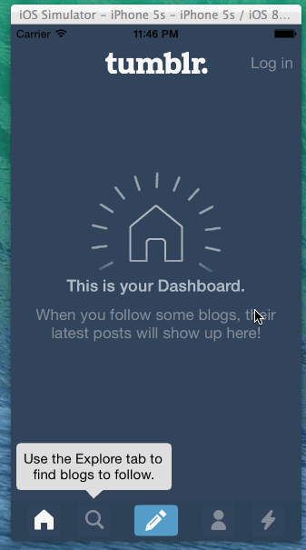

Week5HW
=======
Learning how to do custom transitions from one view controller to another and using custom container view controllers

Time spent: 3.5 hours

Completed user stories
-

#### Required
* [x] Tapping on Home, Search, Account, or Trending should show the respective screen and highlight the tab bar button.
* [x] Compose button should modally present the compose screen.

#### Optional
* [x] Optional: Compose screen is faded in while the buttons animate in.
* [x] Optional: Login button should show animate the login form over the view controller.
* [x] Optional: Discover bubble should bob up and down unless the SearchViewController is tapped.

Walkthrough
-

